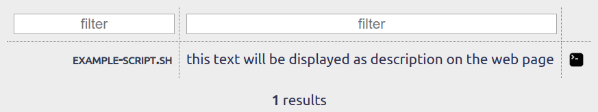
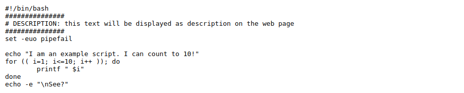

# curlbin

**[curlbin](https://gitlab.winterstein.one/web-apps/curlbin)** is a simple tool to provide cli scripts centrally for execution via curl, so they can be managed centrally without need of updating them anywhere else.

---

On the main page, there is a filterable list of all files in the [`scripts`](scripts/) folder.\
The description is autimatically gathered from the scripts - the page looks for a line beginning with `# DESCRIPTION:` and displays the text after the colon.\

Scripts are linked to their raw versions, so they can be viewed in the browser.\

---

How to use:
1. Download the repository contents to your web server.
1. Put your scripts in the [`scripts`](scripts/) folder.
1. Click the  icon next to a script.
1. Paste the command into a terminal and execute it

CAUTION: Currently all commands are generated to be executed with 'sudo bash' - in a future release, I will add a second button.
