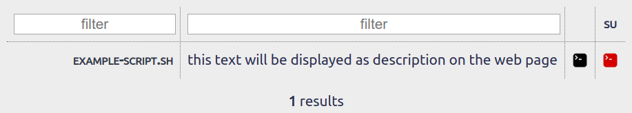

# curlbin

**[curlbin](https://gitlab.winterstein.one/web-apps/curlbin)** is a simple tool to host bash scripts on a single, filterable web page with buttons to copy a command for execution of any of the scripts via curl with and without sudo usage, so they can be managed centrally and used from any server with a working internet connection (I personally set aliases for some of them in my `.bash*` Environment for super easy access).

---

On the main page, there is a filterable list of all files in the [`scripts`](scripts/) folder.\
The description is autimatically gathered from the scripts - the page looks for a line beginning with `# DESCRIPTION:` and displays the text after the colon.\

Scripts are linked to their raw versions, so they can be viewed in the browser.\

---

How to use:
1. Download the repository contents to your web server.
1. Put your scripts in the [`scripts`](scripts/) folder.
1. Click the  icon or the  icon (for sudo usage) next to a script.
1. Paste the command into a terminal and execute it.

Notes:\
I guess this can be easily modified to match personal needs.\
I will probably implement a mechanism that automatically generates the links with the correct binary to execute, if the shebang line of the script is set.
